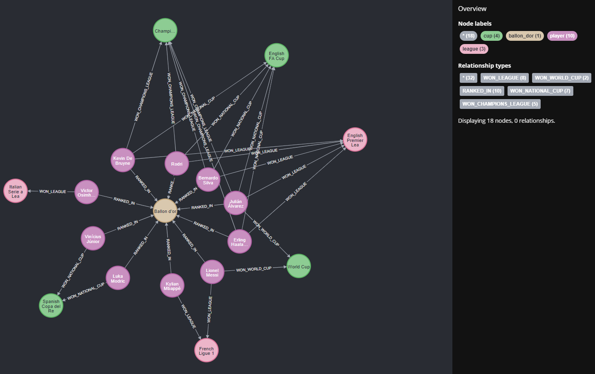

# Best footballers in season 2022/2023

## Overview

This project contains a graph database of football (soccer) player statistics for the 2022/2023 season. It includes information about players, leagues, cups, and the Ballon d'Or award. The database is designed to answer various questions about player performance, physical attributes, and achievements.

## Graph



## Data Model

### Nodes

1. **Player**

   - Properties: fullname, club, nationality, goals, assists, date_of_birth, official_weight, official_height

2. **League**

   - Properties: name, scope

3. **Cup**

   - Properties: name, scope

4. **Ballon d'Or**
   - Properties: name, scope

### Relationships

1. **WON_LEAGUE** (Player to League)

   - Properties: number_of_goals, number_of_assists

2. **WON_NATIONAL_CUP** (Player to Cup)

   - Properties: number_of_goals, number_of_assists

3. **WON_CHAMPIONS_LEAGUE** (Player to Cup)

   - Properties: number_of_goals, number_of_assists

4. **WON_WORLD_CUP** (Player to Cup)

   - Properties: number_of_goals, number_of_assists

5. **RANKED_IN** (Player to Ballon d'Or)
   - Properties: place, number_of_points

## Queries

### 1. Player with the Most Goals in the Season

```cypher
MATCH (n:player)
RETURN n.fullname AS player_with_the_most_goals, n.goals AS goals
ORDER BY n.goals DESC
LIMIT 1;
```

This query returns the player who scored the most goals across all competitions in the 2022/2023 season.

### 2. Average Goals Scored in the Season

```cypher
MATCH (n:player)
RETURN avg(n.goals) AS average_number_of_goals_in_the_whole_season;
```

This query calculates the average number of goals scored by all players in the 2022/2023 season.

### 3. Top Scorer in the World Cup

```cypher
MATCH (p:player)-[r:WON_WORLD_CUP]->(c:cup { name: 'World Cup' })
RETURN p.fullname AS name, r.number_of_goals AS goals
ORDER BY r.number_of_goals DESC
LIMIT 1;
```

This query identifies the player who scored the most goals in the last World Cup.

### 4. Three Oldest Players

```cypher
MATCH (n:player)
RETURN n.fullname AS fullname, duration.between(n.date_of_birth, date()).years AS age
ORDER BY age DESC
LIMIT 3;
```

This query lists the three oldest players in the database, calculating their age based on their date of birth.

### 5. Average Player Height

```cypher
MATCH (n:player)
RETURN avg(n.official_height) AS average_height_of_the_players;
```

This query calculates the average height of all players in the database.

### 6. Average Assists in Champions League

```cypher
MATCH (p:player)-[r:WON_CHAMPIONS_LEAGUE]->(c:cup { name: 'Champions League' })
RETURN avg(r.number_of_assists) AS avg_assists;
```

This query determines the average number of assists made by players who won the Champions League.

### 7. Top 3 Players by Combined Goals and Assists

```cypher
MATCH (p:player)
OPTIONAL MATCH (p)-[r]->(c)
WHERE type(r) IN ['WON_LEAGUE', 'WON_NATIONAL_CUP', 'WON_CHAMPIONS_LEAGUE', 'WON_WORLD_CUP']
WITH p,
     sum(r.number_of_goals) + sum(r.number_of_assists) AS total_contributions,
     sum(r.number_of_goals) AS total_goals,
     sum(r.number_of_assists) AS total_assists
RETURN p.fullname, total_contributions, total_goals, total_assists
ORDER BY total_contributions DESC
LIMIT 3
```

This query finds the top 3 players with the highest combined number of goals and assists across all competitions (league, national cup, Champions League, and World Cup).

## Conclusion

This graph database provides a data about top 10 football players' performances in the 2022/2023 season. The queries demonstrate how to extract valuable insights about player statistics, physical attributes, and achievements across various competitions.
